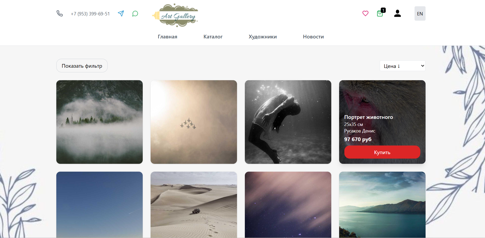

# 🎨 Art Gallery

Интерактивная веб-галерея для просмотра и покупки произведений искусства.  
Проект создан как учебный, но может использоваться как прототип **онлайн-магазина картин, галереи или платформы для художников**.

---

## 🚀 Возможности проекта

- 🔑 Регистрация и авторизация пользователей (**Firebase Auth**)
- 👩‍💼 Админ-панель для управления галереей (CRUD для картин, новостей и пользователей)
- 🖼️ Просмотр картин с подробной информацией
- ❤️ Добавление работ в избранное
- 🛒 Корзина и оформление заказа
- 🌍 Поддержка мультиязычности (**i18n**)
- 📑 Пагинация, сортировка и фильтрация картин
- 📰 Раздел новостей и статьи о художниках

---

## 🛠️ Используемые технологии

- **React 18** + **Vite** — современный фронтенд-стек
- **Zustand** — управление состоянием
- **Firebase (Auth, Firestore, Storage)** — база данных, авторизация и хранение файлов
- **Tailwind CSS** — стилизация интерфейса
- **i18next** — мультиязычность
- **React Router** — маршрутизация между страницами
- **LocalStorage & SessionStorage** — сохранение избранного и корзины

---

## 📂 Структура проекта

src
├── components # UI-компоненты
├── pages # Страницы приложения
├── services # Работа с API и Firebase
├── store # Zustand-хранилища
├── storage # Сохранение сессий
├── config # Конфигурации (Firebase).

## ▶️ Как запустить проект

1. Склонировать репозиторий:

   ```bash
   git clone https://github.com/KristinaBondarenko/Final-project.git

   ```

2. Установить зависимости:

npm install

3. Запустить сервер (json-server для имитации API):

npm run server # http://localhost:3000

4. Запустить приложение:

npm run dev # http://localhost:5173

## 🎯 Польза и назначения проекта

📚 Учебная ценность — проект демонстрирует навыки работы с React, Firebase, Zustand, Tailwind, роутингом, API, локальным хранилищем и мультиязычностью.

🖌️ Прототип галереи — сайт можно использовать как основу для онлайн-площадок художников, где они представляют свои работы, а пользователи могут покупать и сохранять любимые картины.

🛍️ Интернет-магазин — корзина и оформление заказа превращают сайт в рабочую модель e-commerce проекта.

🌍 Международный потенциал — мультиязычность делает проект универсальным для пользователей разных стран.

Проект показывает, что веб-приложение может быть не только красивым, но и полезным инструментом для искусства, образования и коммерции.

## 👩‍🎨 Автор проекта

Разработка: Кристина Бондаренко

GitHub: [KristinaBondarenko](https://github.com/KristinaBondarenko)

## Скриншот проекта



## 🚀 Дальнейшее развитие

Проект "Art Gallery" имеет большой потенциал для дальнейшего развития. Вот несколько идей, которые могут быть реализованы в будущем:

1. Интеграция с платежными системами:
   Добавление поддержки популярных платежных систем, таких как PayPal, Stripe или Яндекс.Касса, для упрощения процесса покупки произведений искусства.
2. Расширение функционала админ-панели:
   Добавление возможности загрузки и управления несколькими изображениями для каждой работы.
   Внедрение системы отзывов и оценок для произведений искусства.
3. Мобильная версия:
   Разработка адаптивного дизайна для мобильных устройств или создание отдельного мобильного приложения.
4. Интеграция с социальными сетями:
   Добавление кнопок для публикации понравившихся произведений искусства в социальных сетях.
   Внедрение системы авторизации через социальные сети.
5. Аукционы и торги:
   Добавление функционала для проведения онлайн-аукционов произведений искусства.
   Личный кабинет пользователя:
6. Внедрение личного кабинета для пользователей с историей покупок, избранным и возможностью управления профилем.

💡 Эти улучшения помогут сделать проект "Art Gallery" более функциональным и привлекательным для пользователей, а также откроют новые возможности для художников и коллекционеров.
